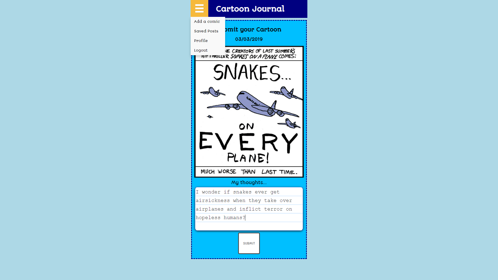
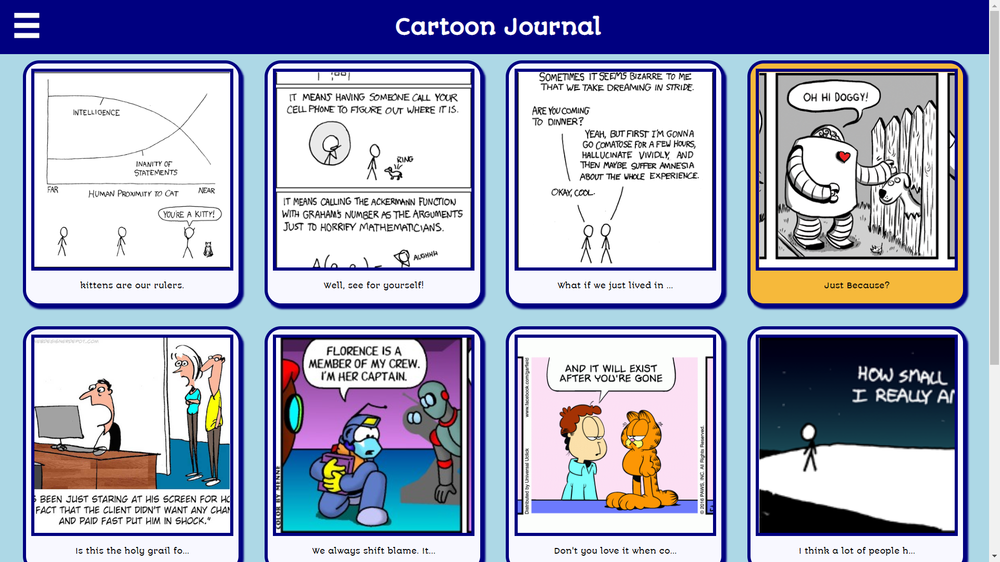

<h1> Cartoon Journal </h1>

<h2> Live Page </h2>
<a href="http://haunted-corpse-92171.herokuapp.com" target="_blank"> Click here! </a>

<h2><u> Summary </u></h2>

 This is an app to help develop a regular writing habit by providing comic strips as inspiration prompts!

<h2><u> Things you can do... </u></h2>
<ul>
  <li> Create your own account to save your comic strips and writing! </li>
  <li> Add your own comic strips or have one generated for you! </li>
  <li> Write your thoughts about the comic strip, or about anything else that comes to mind! Be as thorough as you can!</li>
  <li> Look at your library to see all the comic strips you've collected and all the writing you've contributed! </li>
  <li> Get achievements for writing regularly!</li>
  <li> Save, Edit, Delete and Update any of your posts </li>
 </ul>

<h2>Technologies Used</h2>
<ul>
  <li> HTML5 </li>
  <li> CSS3 </li>
  <li> JS ES6 </li>
  <li> JQUERY </li>
  <li> NODE </li>
  <li> EXPRESS </li>
  <li> MongoDB </li>
</ul>

<h2> Screenshots </h2>

